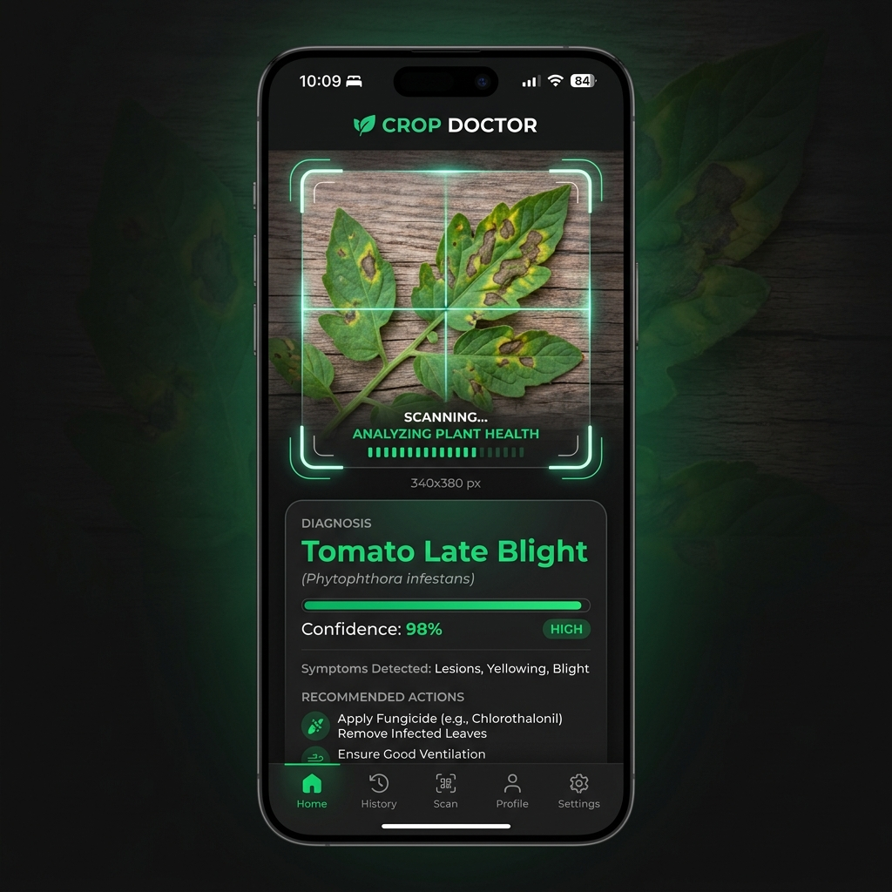

# CropCheckUp

AI-assisted plant leaf disease screening using Flutter, background removal, and TensorFlow Lite.

## Project status
Public/open-source release preparation.

## Features
- Camera capture
- Gallery upload
- Background removal preview
- On-device TFLite inference
- Disease information display
- Dark/light theme
- Landing page

## Screenshots/demo


## Repository structure
- `lib/`
- `assets/`
- `test/`
- `landing/`
- `.github/workflows/`

## Requirements
- FVM
- Flutter `3.41.6` from `.fvmrc`
- Dart SDK from Flutter
- Node `>=22.12.0` for landing

## Setup

Flutter setup commands:
```sh
fvm flutter pub get
fvm flutter run
```

Flutter validation commands:
```sh
fvm flutter analyze
fvm flutter doctor
fvm flutter test
```

Landing setup commands:
```sh
cd landing
npm ci
npm run dev
```

Landing validation commands:
```sh
npm run check
npm run build
npm run lint
```

## Model and dataset
Usage of the bundled model and dataset is strictly non-commercial. For more information, see:
- [Model Card](MODEL_CARD.md)
- [Model License](MODEL_LICENSE.md)
- [Dataset License](DATASET_LICENSE.md)
- [Attribution](ATTRIBUTION.md)

## License
| Component | License |
|---|---|
| Flutter app source code | Apache License 2.0 |
| Landing page source code | Apache License 2.0 |
| Tests and configuration | Apache License 2.0 |
| Trained model artifacts | CC BY-NC-SA 4.0 |
| Derived CropCheckUp dataset | CC BY-NC-SA 4.0 |
| CropCheckUp name/logo/branding | all rights reserved unless stated otherwise |

*Please note that the permissive Apache 2.0 license for source code does not extend to the models or datasets, which are strictly licensed under the non-commercial CC BY-NC-SA 4.0 license.*

## Responsible-use disclaimer
This tool is for educational and demonstrative purposes only and does not constitute professional agricultural advice. Always confirm serious crop issues with a qualified agricultural expert.

## Links
- [GitHub Repo](https://github.com/rasagyavatsal/CropCheckUp)
- [Kaggle Notebook](https://www.kaggle.com/code/rasagyavatsal/cropcheckup)
- [CropCheckUp Kaggle Dataset](https://www.kaggle.com/datasets/rasagyavatsal/cropcheckup-dataset)
