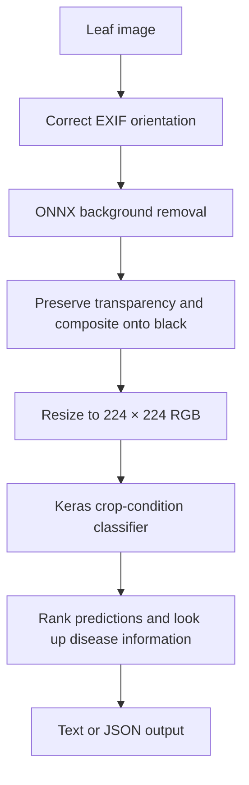

# CropCheckUp

CropCheckUp is a Python command-line tool for identifying crop-leaf conditions
from images. It combines ONNX background removal with a Keras classifier to
predict **68 crop and condition labels across 18 crops**, including healthy
leaves, diseases, and other damage categories.

Each result includes the predicted crop and condition, a confidence score, and
alternative predictions. Symptoms, causes, and management information are
included when available. All image processing and inference run locally with
bundled models, so images do not need to be uploaded to a service.

## Technical highlights

- **Transfer learning:** the training pipeline uses an ImageNet-pretrained
  MobileNetV3Large backbone, first training the classification head and then
  fine-tuning the full network.
- **Training for varied inputs:** image augmentation covers flips, rotation,
  translation, zoom, contrast, and brightness. Class weights adjust the loss
  for imbalanced class counts.
- **Two-model inference pipeline:** ONNX Runtime produces a foreground mask;
  TensorFlow/Keras classifies the processed leaf image.
- **Inspectable preprocessing:** EXIF orientation and transparency are handled
  explicitly, and the exact classifier input can be saved as a PNG.
- **Scriptable interface:** an installable `cropcheckup` command supports
  configurable top-k predictions, custom model directories, and JSON output
  with diagnostics routed to stderr.
- **Validation and tests:** model tensor shapes and types are checked, invalid
  outputs produce clear errors, and tests cover preprocessing, CLI behavior,
  background removal, and inference with the bundled models.

## Architecture


```mermaid
flowchart TD
    A[Leaf image] --> B[Correct EXIF orientation]
    B --> C[ONNX background removal]
    C --> D[Preserve transparency and composite onto black]
    D --> E[Resize to 224 × 224 RGB]
    E --> F[Keras crop-condition classifier]
    F --> G[Rank predictions and look up disease information]
    G --> H[Text or JSON output]
```

| Component | Technology / responsibility |
| --- | --- |
| Model training | TensorFlow/Keras, MobileNetV3Large, augmentation, and fine-tuning |
| Background removal | ONNX Runtime with CPU inference |
| Image preparation | Pillow and NumPy |
| Command-line interface | Python `argparse`, text and JSON output |
| Packaging and tests | `setuptools`, `unittest` |

## Dataset and model training

The project's [dataset attribution](ATTRIBUTION.md) records the CropCheckUp
dataset and Kaggle notebook, along with source datasets including PlantVillage
and the Mango Leaf Disease Dataset. Dataset terms are documented in
[DATASET_LICENSE.md](DATASET_LICENSE.md).

The bundled [label list](src/cropcheckup/models/labels.txt) covers apple,
blueberry, bottle gourd, cherry, corn, grape, mango, orange, papaya, peach,
bell pepper, potato, raspberry, soybean, squash, strawberry, tomato, and
zucchini. The 68 labels represent crop–condition pairs.

The [training script](scripts/train.py) defines the following configuration:

| Setting | Configuration |
| --- | --- |
| Backbone | MobileNetV3Large with ImageNet weights and global average pooling |
| Classifier head | Dropout (0.3), dense layer, and softmax |
| Input | 224 × 224 RGB images |
| Data split | 80% training / 20% validation, with seed 123 |
| Batch size | 64 |
| Initial training | Frozen backbone, Adam learning rate 0.001, up to 20 epochs |
| Fine-tuning | Full backbone unfrozen, Adam learning rate 0.0001, up to 20 epochs |
| Training controls | Class weighting, early stopping, and learning-rate reduction on validation loss |
| Export | Keras inference model without augmentation, plus labels in model output order |

The script tracks training and validation accuracy and loss. Saved evaluation
results are not included in this repository, so no benchmark accuracy or F1
score is reported here.

## Setup

Use Python 3.12. From the repository root, create an environment and install
the dependencies:

```sh
python3.12 -m venv .venv
. .venv/bin/activate
python -m pip install -e .
```

The package dependencies include TensorFlow for the Keras classifier, ONNX
Runtime for background removal, NumPy, and Pillow. The bundled models run
locally; inference does not need a network connection.

## Classify an image

```sh
cropcheckup leaf.jpg
cropcheckup leaf.jpg --save-processed processed.png
cropcheckup leaf.jpg --json
```

The CLI accepts PNG, JPEG, WebP, and other Pillow-readable formats.

- `--top-k 5`: show the five highest-scoring predictions (default: 3).
- `--json`: output results as JSON; diagnostics go to stderr.
- `--save-processed PATH`: save the final 224×224 RGB classifier input as a
  lossless PNG for visual inspection. The source image is left intact and cannot
  be used as the output path.
- `--model-dir PATH`: load `plant_disease_model.keras`, `labels.txt`,
  `disease_info.json`, and `background_removal.onnx` from another directory
  (default: the package's bundled models directory, located at
  `src/cropcheckup/models/` in this repository). All four files are required.

## Image preprocessing

By default, the CLI corrects EXIF orientation, removes the background with the
bundled ONNX model, preserves existing transparency, and composites the result
onto black. It then resizes the entire image to 224×224 with bilinear
interpolation and passes float32 RGB values in `[0, 255]` to the Keras
classifier. Rectangular images are resized without cropping or padding. If
background removal fails, classification stops with an error instead of using
the original photo.

Background removal adds CPU work and memory use. The ONNX file is about
4.6 MB. Its input is 320×320, but the mask is applied at the source image's full
resolution, with no 1024-pixel limit.

### Background-removal model

The bundled [`background_removal.onnx`](src/cropcheckup/models/background_removal.onnx) was
recovered from the [historical CropCheckUp browser implementation](https://github.com/rasagyavatsal/CropCheckUp/tree/b8036567f6af4208d61202167a3022549ebfdc75).
It was previously used for app input images. The model used to prepare the
training dataset has not been identified, so we cannot establish that it was
the same model. The ONNX asset is BSD 3-Clause licensed; its [full notice](src/cropcheckup/models/BACKGROUND_REMOVER_LICENSE.txt)
and further [attribution](ATTRIBUTION.md) are included in this repository.

## Train the model

Place training images in `CropCheckUp-dataset/`, with one subdirectory per class,
then run `python scripts/train.py` from the repository root. The script trains
a MobileNetV3Large classifier and saves the model and labels to
`plant_disease_outputs/`.

With an editable install, copy `plant_disease_model.keras` and its matching
`labels.txt` into `src/cropcheckup/models/`, keeping `disease_info.json` and
`background_removal.onnx` alongside them. For a regular install, put all four
files in another directory and select it with `--model-dir`. The CLI requires
68 labels in model output order.

## Tests

The test suite covers image orientation, alpha compositing, tensor preparation,
processed-image export, text and JSON output, model validation, and error
handling. It also includes an inference smoke test using the bundled models
and a generated image.

```sh
python -m unittest discover -s tests -p 'test_*.py' -v
```

## License and attribution

Source code: [Apache-2.0](LICENSE). The bundled classifier assets are
[CC-BY-NC-SA-4.0](MODEL_LICENSE.md) (non-commercial); the background-removal
model is [BSD 3-Clause](src/cropcheckup/models/BACKGROUND_REMOVER_LICENSE.txt). See
[DATASET_LICENSE.md](DATASET_LICENSE.md) and [ATTRIBUTION.md](ATTRIBUTION.md)
for dataset terms, sources, and citations.
